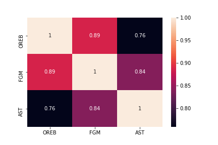
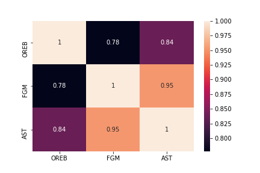
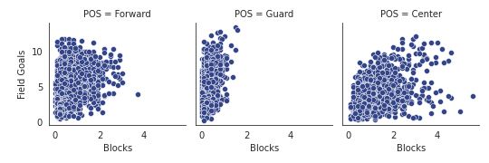
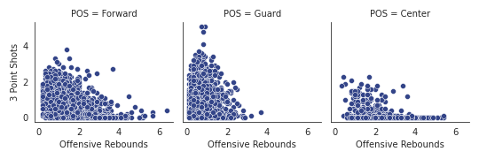
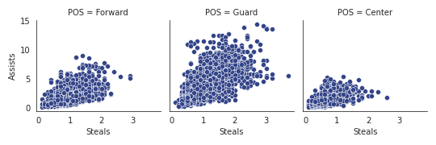
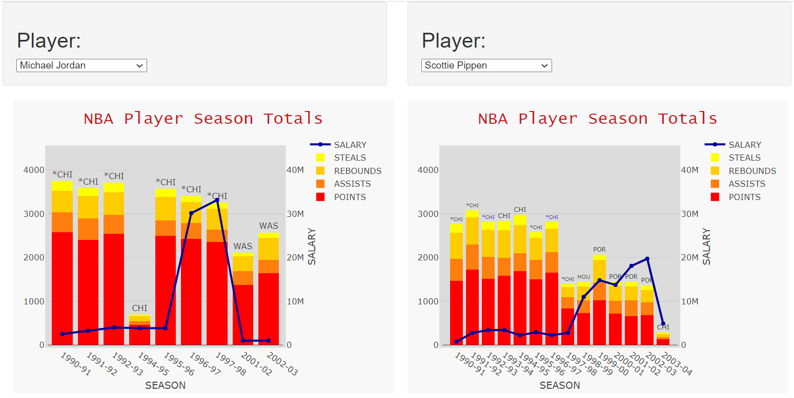

# Final_Project

## Background
NBA Statistics between 1984-2019 observed and visualized using multiple tools/languages including Python, Seaborn, Javascript, HTML, JSON
## Machine Learning
Seaborn coding used to build heat maps illustrating the correlation between Offensive Rebounds, Field Goals and Assists.
This shows that Michael Jordan took more frequent personal action of making field goals after rebounding the ball  vs the league as a whole.

### Seaborn Heatmaps
#### Michael Jordan

#### NBA

### SEABORN SCATTERED FACETGRID
These grids illustrate the correlation of on-court actions by player position suggesting the following:  
1) Guards take more action making field goals vs. blocking attempted shots. 
2) Centers dominate blocking shots while highly contributing to field goals as well. 
3) Centers make numerous offensive rebounds that often do not turn into 3-Pointers.
4) Guards drive a greater number of Assists when stealing the ball.  
5) Forwards land in between each comparison.
#### Field Goals Made vs. Blocks

#### Offensive Rebounds vs 3-Point Shots

#### Steals vs Assist

## JavaScript-HTML
Utilized Plotly to build an adjustable, dual-axis, grouped Line & Bar Graph to compare seasonal totals of player Steals, Rebounds, Assists and Points in comparison to annual salary between 1990 - 2020.  
http://localhost:8000

